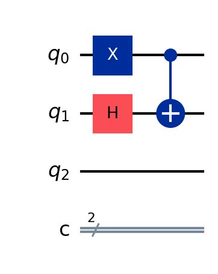
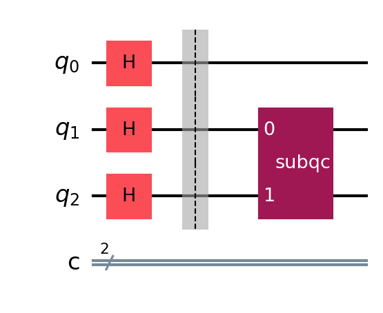
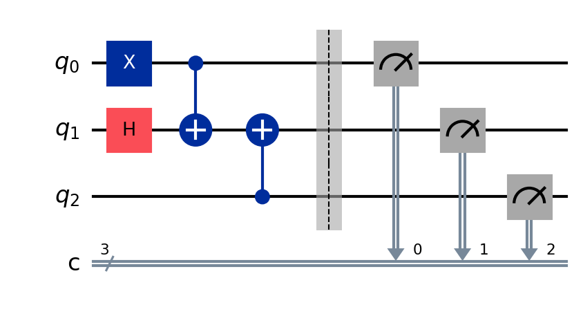
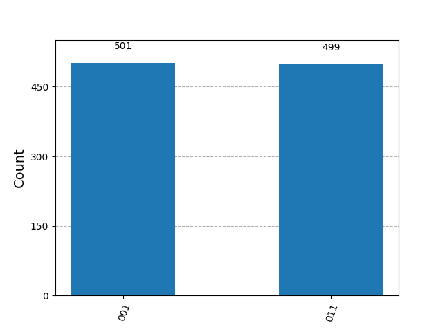
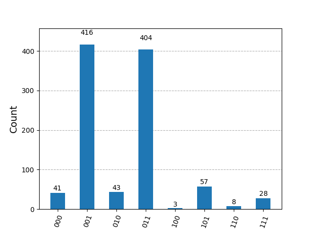
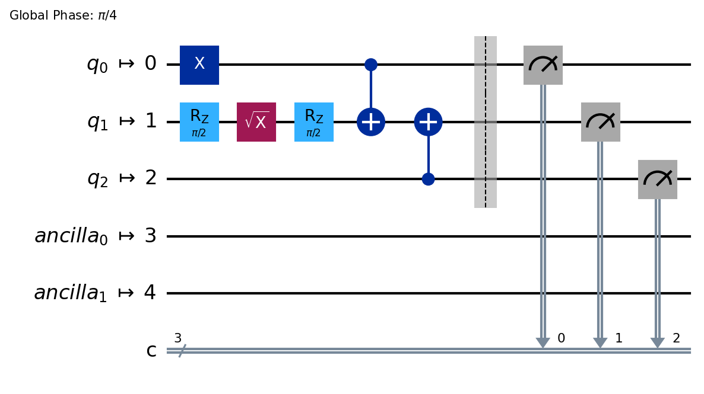
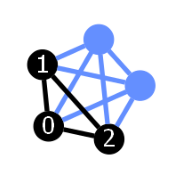
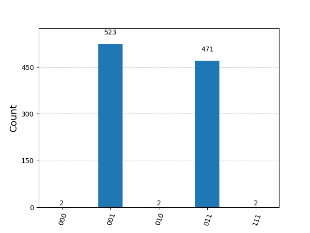

# QuantumLab
This is the lab repo of quantum progamming course CS238 taught by professor Jens Palsberg in 2024 Fall quarter.
In this lab, you will have hands-on experience of quantum programming with qiskit. 

In this lab, you will

* Learn how to create and compile a quantum circuit by yourselves with qiskit.
* Learn how to run and debug your quantum circuit by running simulation.
* Get more familiar with quantum gates, quantum fourier transform, quantum phase estimation and shor's algorithm
* Learn how to run simulation of your quantum algorithm on a noisy fake quantum computer provided by qiskit.


# Environment set up


The installation process has been tested under python version 3.11
If there is some bug during your installation, please downgrade your python to 3.11 first

https://www.python.org/downloads/release/python-3110/


I suggest that you should create a new lightweight virtual environment to avoid conflict of packgae dependency.
First, please ensure that you have installed virtialenv:

```console
python -m pip install --user virtualenv
python -m virtualenv --help
```

You can visit the document page of virtualenv to get more detailed explanation of how this works:
[Documentation of virtualenv](https://virtualenv.pypa.io/en/stable/installation.html)


Next, create a new virtual enviroment using virtualenv under the same directory.

```console
python -m venv ./IBMLabVenv
```

You will notice that a new folder IBMLabVenv/ appear in the same directory of this IBMlab. This folder store all information of python package and compiled library that you might need later.


You can visit the document page of venv command to get more detailed explanation of how this works:
[Documentation of venv](https://docs.python.org/3/library/venv.html)


After create the virtual enviroment, you can activate it by running the following instruction:


```console
.\IBMLabVenv\Scripts\activate
```


Install all required package by:


```console
pip install -r requirements.txt 
```


# Run Jupyter note book


First activate your virtual environment, then start the jupyter notebook:

```console
jupyter notebook
```


# Basic of qiskit

Here we will explore some most important interface that is related to the homework. To have a better understanding, you can copy and execute all the code snippets to jupyter notebook and play around with it by yourselves.


## Circuit construction and visualization
To initialize a quantum circuit with qiskit, import qiskit package and use QuantumCircuit function:


```python
from qiskit import QuantumCircuit
qc=QuantumCircuit(3,2) # Initialize a circuit with 3 qubits and 2 classical bits
```

To add quantum gate to the quantum circuit, you can either 
```python
qc.x(0) #Add PauliX gate to qubit 0
qc.h(1) #Add Hadamard gate to qubit 1
qc.cx(0,1) #Add a CNOT gate to qubit 0,1 controlled by qubit 0
```


Or by calling method append method:

```python
from qiskit.circuit.library import XGate,HGate,CXGate
qc.append(XGate(),[0]) #Add PauliX gate to qubit 0
qc.append(HGate,[1]) #Add Hadamard gate to qubit 1
qc.append(CXGate(),[0,1]) #Add a CNOT gate to qubit 0,1 controlled by qubit 0
```


To append a small user defined quantum circuit to a larger one, you can also use the method append:

```python
from qiskit import QuantumCircuit
qc=QuantumCircuit(3,2) # Initialize a circuit with 3 qubits and 2 classical bits
qc.h(0)
qc.h(1)
qc.h(2)
qc.barrier()
subqc=QuantumCircuit(2,0,name="subqc") # Initialize your subcircuit. You can label it a new name
subqc.cx(1,0)
subqc.h(1)
subqc.y(0)
subqc.cx(0,1)
# Append the subcircuit to your original circuit. 
# You should specify where you want to insert you subcircuit on your second parameter.
# Here, the 0th qubit of subqc is mapped to the 1th qubit, the 1th qubit of subqc is mapped to the 2nd qubit
qc.append(subqc,[1,2]) 
```

Visualization is a good way to debug your circuit interactively. Qiskit has implemented a built-in method draw for visualization:
```python
qc.draw('mpl')
```

Sometimes you may want to store the figure to your local computer, to do that, pass another parameter filename to the draw method:

```python
qc.draw('mpl',filename='filename.png')
```




If you are curious about the matrix of your circuit, you can get it by running the following commands:

```python
from qiskit.quantum_info import Operator
U = Operator(qc)
print(U.data)
```





## Run simulation and plot results

QuantumCircuit class that we initialized above won't calculate automatically for you. To execute your circuit, you have to run it by yourselves.
A quantum citcuit in qiskit has both quantum registers and classical registers, the measurement result is stored in classical register.


To run simulation, don't foget to add measurement:

```python
from qiskit import QuantumCircuit
qc=QuantumCircuit(3,3) # Initialize a circuit with 3 qubits and 2 classical bits
qc.x(0) #Add PauliX gate to qubit 0
qc.h(1) #Add Hadamard gate to qubit 1
qc.cx(0,1) #Add a CNOT gate to qubit 0,1 controlled by qubit 0
qc.cx(2,1) #Add a CNOT gate to qubit 2,1 controlled by qubit 2
qc.barrier()
qc.measure([0,1,2],[0,1,2]) # Add measurement on the computational basis.
qc.draw("mpl")
```




To run the ideal simulation and get the result, we need to include a backend AerSimulator


you can run the following codes:
```python
from qiskit_aer import AerSimulator
from qiskit.visualization import plot_histogram
backend = AerSimulator()
job = backend.run(qc, shots=1000) # Run the circuit 1000 times 
output = job.result().get_counts() 
plot_histogram(output) #Plot the result
```




## Simulation with customized noise model

You are asked to run your circuit simulation with some noise level.


you can run the following codes:
```python
from qiskit_aer import AerSimulator
from qiskit.visualization import plot_histogram
from noisemodel import construct_bitphaseflip_noise_model
backend = AerSimulator()
noise_model=construct_bitphaseflip_noise_model(0.1,0.1,0.1)
job = backend.run(qc, shots=1000,noise_model=noise_model) # Run the circuit 1000 times 
output = job.result().get_counts() 
plot_histogram(output) #Plot the result
```




## Simulation on fake provider

In this lab, you are required to run your simulation on IBM fake provider, which simulate the real noisy environment on a superconducting quantum computer. 


```python
from qiskit import QuantumCircuit, transpile
from qiskit.providers.fake_provider import GenericBackendV2
from qiskit.visualization import plot_histogram
 
# Generate a 20-qubit simulated backend
backend = GenericBackendV2(num_qubits=20)
 

qc=QuantumCircuit(3,3) # Initialize a circuit with 3 qubits and 2 classical bits
qc.x(0) #Add PauliX gate to qubit 0
qc.h(1) #Add Hadamard gate to qubit 1
qc.cx(0,1) #Add a CNOT gate to qubit 0,1 controlled by qubit 0
qc.cx(2,1) #Add a CNOT gate to qubit 2,1 controlled by qubit 2
qc.barrier()
qc.measure([0,1,2],[0,1,2]) # Add measurement on the computational basis.
 
# Transpile the ideal circuit to a circuit that can be directly executed by the backend
transpiled_circuit = transpile(qc, backend)
transpiled_circuit.draw('mpl')
 
# Run the transpiled circuit using the simulated backend
job = backend.run(transpiled_circuit,shots=1000)
counts = job.result().get_counts()
plot_histogram(counts)
```

The transpiled circuit is shown as:




You can also draw the layout and visulize the mapping of the virtual qubit to the real qubit by:

```python
from qiskit.visualization import plot_circuit_layout
fig=plot_circuit_layout(transpiled_circuit,backend)   

# Save the figure to a file, e.g., as 'layout.png'
fig.savefig('Figure/layout.png')
```




The result of the above simulation is:




# IBM Lab1: Quantum Circuits


In this lab, you will learn and practice how to create quantum circuit and implement basic logic gates, such as AND, OR, XOR gate. 
We will grade you partly by the correctness of logical gate implementation.

To run autotest your self for function NOT,AND,NAND,OR,ANDOR for yourself, you can copy your implemention to test/testlogic.py file and excute the script directly.

```console
cd test
python testlogic.py
```


# IBM Lab2: Accuracy of Quantum Phase Estimation

In this lab, you will implement quantum phase estimtation.


# IBM Lab3: Scalable Shor's algorithm


In this lab, you will learn how to implement scalable shor's algorithm.


# Reference

