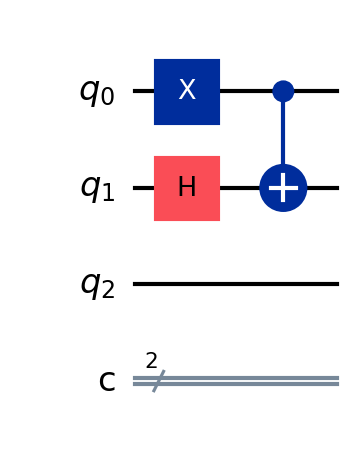
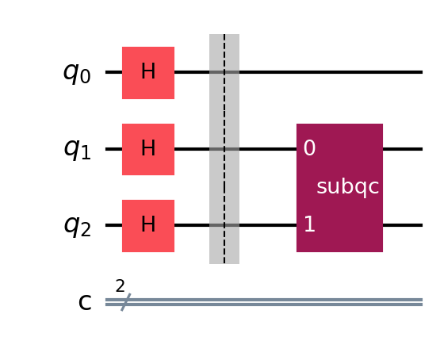
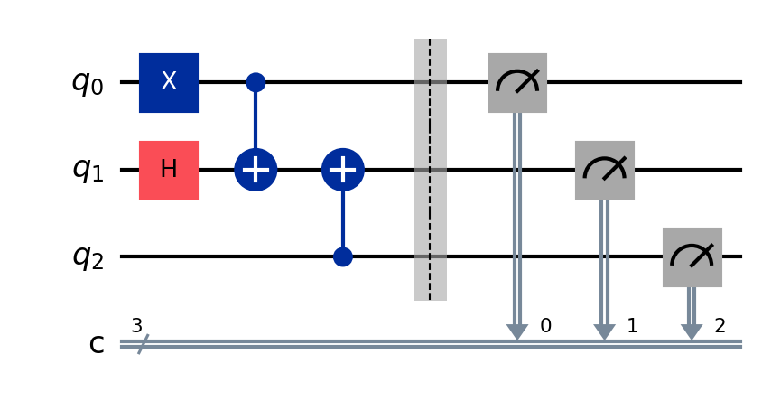
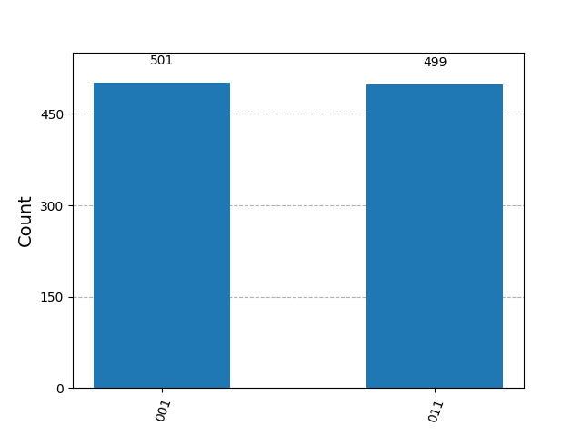
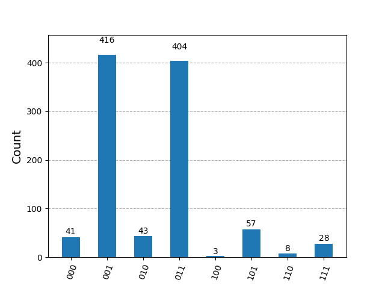
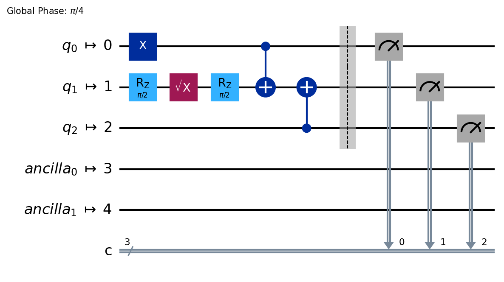
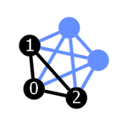
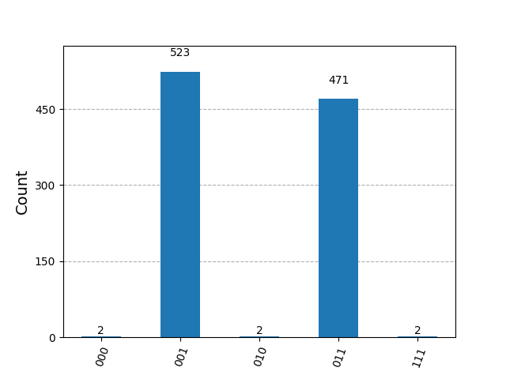

# QuantumLab

This is the lab repository for the **Quantum Programming course (CS238)** taught by Professor Jens Palsberg in the Fall 2025 quarter in UCLA.  
In this lab, you will gain hands-on experience with **quantum programming using Qiskit**.  

You will:

* Learn how to create and compile quantum circuits with Qiskit.  
* Learn how to run and debug circuits using simulation.  
* Become familiar with quantum gates, the Quantum Fourier Transform (QFT), Quantum Phase Estimation (QPE), and Shor’s Algorithm.  
* Learn how to simulate your algorithms on noisy backends and fake quantum computers provided by Qiskit.  

---


# Environment set up

The installation process has been tested with **Python 3.11**.  
If you encounter issues, please downgrade to Python 3.11:  

👉 [Download Python 3.11](https://www.python.org/downloads/release/python-3110/)

It is recommended to use a **lightweight virtual environment** to avoid dependency conflicts.  

First, install `virtualenv`:

```console
python -m pip install --user virtualenv
python -m virtualenv --help
```


You can visit the document page of virtualenv to get more detailed explanation of how this works:
[Documentation of virtualenv](https://virtualenv.pypa.io/en/stable/installation.html)


Next, create a new virtual enviroment using virtualenv under the same directory.

```console
python -m venv ./IBMLabVenv
```

You will notice that a new folder IBMLabVenv/ appear in the same directory of this IBMlab. This folder store all information of python package and compiled library that you might need later.


You can visit the document page of venv command to get more detailed explanation of how this works:
[Documentation of venv](https://docs.python.org/3/library/venv.html)


After create the virtual enviroment, you can activate it by running the following instruction:


```console
.\IBMLabVenv\Scripts\activate
```


Install all required package by:


```console
pip install -r requirements.txt 
```


# Run Jupyter note book


First activate your virtual environment, then start the jupyter notebook:

```console
jupyter notebook
```


# Basic of qiskit


In this section, we will explore the key Qiskit interfaces relevant to the homework.  
For a better understanding, copy the code snippets into a Jupyter notebook and experiment with them on your own.


## Circuit construction and visualization

To initialize a quantum circuit in Qiskit, import the package and use the `QuantumCircuit` class:

```python
from qiskit import QuantumCircuit
qc=QuantumCircuit(3,2) # Initialize a circuit with 3 qubits and 2 classical bits
```

You can add quantum gates to the circuit directly with built-in methods:


```python
qc.x(0) #Add PauliX gate to qubit 0
qc.h(1) #Add Hadamard gate to qubit 1
qc.cx(0,1) #Add a CNOT gate to qubit 0,1 controlled by qubit 0
```

Alternatively, you can use the append method:

```python
from qiskit.circuit.library import XGate,HGate,CXGate
qc.append(XGate(),[0]) #Add PauliX gate to qubit 0
qc.append(HGate,[1]) #Add Hadamard gate to qubit 1
qc.append(CXGate(),[0,1]) #Add a CNOT gate to qubit 0,1 controlled by qubit 0
```


You can also append a small user-defined subcircuit to a larger circuit:


```python
from qiskit import QuantumCircuit
qc=QuantumCircuit(3,2) # Initialize a circuit with 3 qubits and 2 classical bits
qc.h(0)
qc.h(1)
qc.h(2)
qc.barrier()
subqc=QuantumCircuit(2,0,name="subqc") # Initialize your subcircuit. You can label it a new name
subqc.cx(1,0)
subqc.h(1)
subqc.y(0)
subqc.cx(0,1)
# Append the subcircuit to your original circuit. 
# You should specify where you want to insert you subcircuit on your second parameter.
# Here, the 0th qubit of subqc is mapped to the 1th qubit, the 1th qubit of subqc is mapped to the 2nd qubit
qc.append(subqc,[1,2]) 
```

Visualization is a useful way to debug your circuit interactively.
Qiskit provides a built-in draw method:


```python
qc.draw('mpl')
```

To save the diagram as an image file, include a filename:

```python
qc.draw('mpl',filename='filename.png')
```

<!--  -->

<p align="center"> <br> <em>Figure 1: Example circuit visualization in Qiskit</em> </p>


If you want to see the unitary matrix representation of your circuit:

```python
from qiskit.quantum_info import Operator
U = Operator(qc)
print(U.data)
```


<!--  -->

<p align="center"> <br> <em>Figure 2: Matrix representation of the subcircuit</em> </p>


## Run simulation and plot results

The `QuantumCircuit` we created above does not execute automatically.  
To run a circuit, you must explicitly **simulate** it.  

A Qiskit circuit consists of both **quantum registers** and **classical registers**.  
Measurement results are stored in the classical registers.  

When running a simulation, don’t forget to **add measurement operations**:


```python
from qiskit import QuantumCircuit
qc=QuantumCircuit(3,3) # Initialize a circuit with 3 qubits and 2 classical bits
qc.x(0) #Add PauliX gate to qubit 0
qc.h(1) #Add Hadamard gate to qubit 1
qc.cx(0,1) #Add a CNOT gate to qubit 0,1 controlled by qubit 0
qc.cx(2,1) #Add a CNOT gate to qubit 2,1 controlled by qubit 2
qc.barrier()
qc.measure([0,1,2],[0,1,2]) # Add measurement on the computational basis.
qc.draw("mpl")
```

<!--  -->

<p align="center"> <br> <em>Figure 3: Adding measurement operations</em> </p>


To run an **ideal (noise-free) simulation** and obtain the results, we use the `AerSimulator` backend.  
You can run the following code:

```python
from qiskit_aer import AerSimulator
from qiskit.visualization import plot_histogram
backend = AerSimulator()
job = backend.run(qc, shots=1000) # Run the circuit 1000 times 
output = job.result().get_counts() 
plot_histogram(output) #Plot the result
```

<p align="center"> <br> <em>Figure 4: Ideal simulation result histogram</em> </p>

<!--  -->


## Simulation with customized noise model


In this part of the lab, you will run your circuit under a **noisy simulation**.  
We use a custom noise model to introduce bit-flip and phase-flip errors at specified probabilities.

Example:

```python
from qiskit_aer import AerSimulator
from qiskit.visualization import plot_histogram
from noisemodel import construct_bitphaseflip_noise_model
backend = AerSimulator()
noise_model=construct_bitphaseflip_noise_model(0.1,0.1,0.1)
job = backend.run(qc, shots=1000,noise_model=noise_model) # Run the circuit 1000 times 
output = job.result().get_counts() 
plot_histogram(output) #Plot the result
```

<!--  -->


<p align="center"> <br> <em>Figure 5: Simulation with a customized noise model</em> </p>

## Simulation on fake provider

In this lab, you are also required to run simulations on an **IBM fake provider**, which mimics the behavior of a real noisy superconducting quantum computer.
Next, transpile the circuit for the backend and run the simulation:

```python
from qiskit import QuantumCircuit, transpile
from qiskit.providers.fake_provider import GenericBackendV2
from qiskit.visualization import plot_histogram
 
# Generate a 20-qubit simulated backend
backend = GenericBackendV2(num_qubits=20)
 

qc=QuantumCircuit(3,3) # Initialize a circuit with 3 qubits and 2 classical bits
qc.x(0) #Add PauliX gate to qubit 0
qc.h(1) #Add Hadamard gate to qubit 1
qc.cx(0,1) #Add a CNOT gate to qubit 0,1 controlled by qubit 0
qc.cx(2,1) #Add a CNOT gate to qubit 2,1 controlled by qubit 2
qc.barrier()
qc.measure([0,1,2],[0,1,2]) # Add measurement on the computational basis.
 
# Transpile the ideal circuit to a circuit that can be directly executed by the backend
transpiled_circuit = transpile(qc, backend)
transpiled_circuit.draw('mpl')
 
# Run the transpiled circuit using the simulated backend
job = backend.run(transpiled_circuit,shots=1000)
counts = job.result().get_counts()
plot_histogram(counts)
```


The transpiled circuit looks like this:

<!--  -->


<p align="center"> <br> <em>Figure 6: Transpiled circuit for the fake backend</em> </p>

You can also visualize how the virtual qubits in your circuit are mapped to the physical qubits of the backend:


```python
from qiskit.visualization import plot_circuit_layout
fig=plot_circuit_layout(transpiled_circuit,backend)   

# Save the figure to a file, e.g., as 'layout.png'
fig.savefig('Figure/layout.png')
```




The result of the above simulation is:




# Reference


Here are some relevant references for the lab.


* [Qiskit Documentation](https://qiskit.org/documentation/)  
* Michael A. Nielsen and Isaac L. Chuang, *Quantum Computation and Quantum Information*, Cambridge University Press, 2010.  
* [Qiskit Textbook: Learn Quantum Computation Using Qiskit](https://qiskit.org/textbook/)  
* John Preskill, *Lecture Notes for Physics 219: Quantum Computation* (Caltech), available online.  
